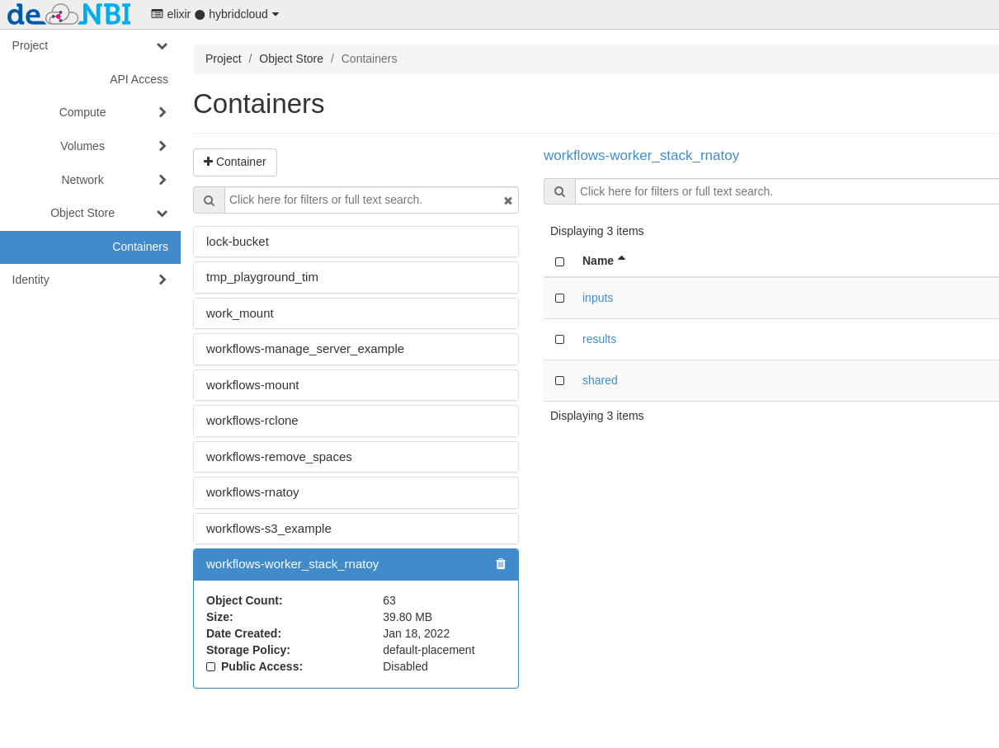

## S3/Swift object storage in the de.NBI Cloud

### Introduction

Object storage is a type of storage to store and share data in cloud environments. An object consists of a unique name,
the actual data and associated metadata (like access restrictions and user defined metadata). Contrary to filesystems
objects are not organised in a hierarchy, but in a flat container. The data is accessed via http based 
protocols/APIs (application programming interfaces), like s3 and swift.

Object stores have a higher abstraction from the underlying hardware than filesystems, enabling for more flexibility
on the administration side, e.g. distribution of data, replication of data and transparent storage capacity extension.

Users benefit from the ubiquitous availability of the storage service. The data can be accessed and written from 
anywhere, as long as the user has the appropriate access/write permissions. These permissions can be controlled
via access control lists by the container owners. With the concept of large objects, object have no size limitations.
A caveat on object stores is the possible higher network latency between the storage servers and the client machines.

### Object storage access 

Depending on the cloud site the object storage is based on different storage backends. It can be accessed using 
the [https://docs.aws.amazon.com/AmazonS3/latest/API/Welcome.html](S3-API). SThese APIs differ in
their terminology, capabilities and respective tools: Objects are stored in containers (swift) or buckets (s3).
Access is controlled via access control lists (s3 and swift) or via policies (only s3).

URLs of de.NBI Cloud Object Storage APIs:

* Bielefeld (based on Ceph): [https://openstack.cebitec.uni-bielefeld.de:8080](https://openstack.cebitec.uni-bielefeld.de:8080)
* Giessen (based on Ceph): [https://s3.computational.bio.uni-giessen.de](https://s3.computational.bio.uni-giessen.de)
* Tuebingen (based on Quobyte) : [https://s3.denbi.uni-tuebingen.de](https://s3.denbi.uni-tuebingen.de)

### Access via website

The OpenStack dashboard provides basic operation like creating containers(buckets) and upload/download of objects.  

By clicking on **Containers**, the object storage buckets available to the current project are displayed:



### Access via s3

S3 offers a lot of functionality and a very fine-grained authorization model 
(see [ Amazon's description of the S3 API](http://docs.aws.amazon.com/AmazonS3/latest/API/Welcome.html)).
The functionality in the OpenStack dashboard offers only the bare minimum to handle buckets and files.

In all standard use cases, **a bucket should be created via the OpenStack dashboard**. This assigns the
bucket to the OpenStack project, and will grant all project user's access to the bucket. Buckets for
individual users or use cases are possible, but require a different way to create access credentials.
Contact the de.NBI cloud team if you need such a bucket.

#### Retrieving access credentials

Access to the S3 API requires S3 credentials. The credentials are bound to a project, so different 
projects require different credentials.

Unfortunately the OpenStack dashboard does not provide access to the necessary credentials, so the command
line has to be used:

* Create [https://cloud.denbi.de/wiki/Compute_Center/Bielefeld/#application-credentials-use-openstack-api](Application credentials)

* Source the downloaded file in a terminal session on the machine you want to access the object storage from.

* You can list all your S3 access keys using 

```bash
openstack ec2 credentials list
```    

*  To create new credentials, use

```bash
openstack  ec2 credentials create
```    

*  The ''access'' and ''secret'' values are the credentials for accessing the S3 buckets of the project.

#### Configuration of the minio client

Another nice command line client is [minio](https://docs.minio.io/docs/minio-client-quickstart-guide), 
providing an alternative to UNIX commands like ls, cat, cp, mirror, 
diff, find etc. It supports filesystems and Amazon S3 compatible cloud storage service (AWS Signature v2 and v4).

Under Linux, you can just download the client:

```bash
wget https://dl.minio.io/client/mc/release/linux-amd64/mc
chmod +x mc
./mc --help
```

To add one or more Amazon S3 compatible hosts, follow the instructions below ''mc'' stores all its 
configuration information in ''~/.mc/config.json'' file.

```bash
mc config host add <ALIAS> <YOUR-S3-ENDPOINT> <YOUR-ACCESS-KEY> <YOUR-SECRET-KEY>
```

For details check out the [Minio webpage](https://docs.minio.io/).


#### Configuration of the s3cmd client

Using the `s3cmd` command line utility, this section demonstrates how to access the S3 object storage. 
The setup should be similar for other tools, libraries or applications.

*  Invoke `s3cmd --configure` to start the interactive configuration dialog
*  Enter the access and secret key
*  Do not change the default region
*  Setup encryption if necessary, or press enter to skip it
*  Use HTTPS protocol (S3 at de.NBI Cloud is **NOT** available via HTTP)
*  Enter proxy details if necessary
*  Skip test access since s3cmd contacts the amazon servers by default
*  Save settings
*  Edit the generated configuration and change the `host_base` value to `S3_ENDPOINT` (for s3 endpoint URLs, see above)
*  Change `host_bucket` value to `%(bucket).S3_ENDPOINT` (for s3 endpoint URLs, see above)
*  Test the configuration, e.g. by invoking `s3cmd ls` to list all buckets. The output should print one line containing `s3://<bucket name>` for all buckets in the project
If you need access to different project, you can create multiple configuration files with s3cmd.

### Limitations 

Depending on the storage backend and versions some features of S3 might not supported.

- https://docs.ceph.com/en/latest/radosgw/s3/