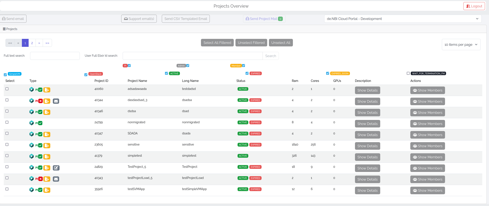
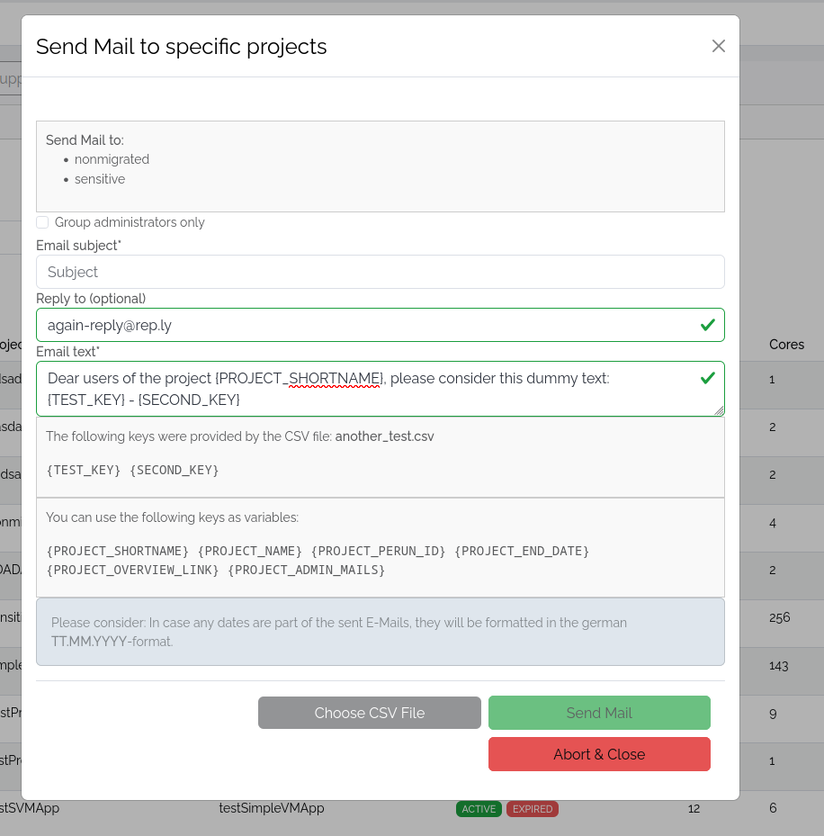

# Project Management

## Project Applications

For the selected facility the facility managers can both manage the current project applications and view the application history.

## Applications for review

!!! Info "Project types"
    This section only holds OpenStack projects associated with the facility, as the SimpleVM projects are handled in a pool-project running in OpenStack. This pool-project is handled as an individual project application.

The review area of the application management holds 5 tabs.
Each of the projects listed in these tabs have been processed by the VO before they get listed here. 

* **Submitted Applications**
    <br>
    This tab shows the initial project applications that got approved the VO governance and got allocated to the corresponding facility. The facility managers in charge now have the ability to finally approve and allocate the project resources.
    
    One can view the project information and approve or decline the project application. An approval leads to an final allocation of the project resources.
    When the project gets declined, it is handed back to the VO, which then can asign it to another facility or get in contact with both the user who submitted the application as well as the facility to adjust the application accordingly.

* **Credit Extension requests**
    <br>
    This area is currently not in operation, as the credit system is not in use at the moment.

* **Lifetime Extension Requests**
    <br>
   This tab holds the projects that applied for an extension of their lifetime. The VO managers already accepted the extension. Again the information on the project and also on the extension requested can be shown and then either be approved or declined. An approval leads to an extension of the project allocation at the facility, while a decline hands the extension request back to the VO managers.

* **Resource Modification Requests**
    <br>
    This tab holds the applications for resource adjustments. The approval and decline process is analogous to the previous tabs. When showing the resources tab of a single project listed in this area, one is able to see the changes, that the people in charge of the project want to make to the project resources. Both increases and decreases of VM, VCPU and RAM numbers, as well the number of GPUs and amount of stoarge is listed here.

* **Termination Requests**
    <br>
    This tab holds the request for project terminations. Again, the facility managers are able to approve the termination, which will terminate the project irrevocable or decline the termination, e.g. when the project users are in contact with the facility managers regarding the backing up of data.

### Application History

The application histroy holds all project that are and have been allocated to the chosen facility. The list holds the basic information, like the date the application for the project got submitted, the project name and the status, as well as the institute associated with the project.
Icons on the left side of the listing indicate the project type, the PI-approval state, if the project processes sensitive data or is used for workshops.

When clicking on *Show Information* more details are shown for the corresponding project. The tab *PI/User* holds information on the user which originally submitted the project application and the PI who is responsible for the project.
The tab *Information* holds project specific information like the project description, the research topics handled in the course of the project, the lifetime of the project and further information.
The tab *Resources* holds the information on the cloud resources assigned to the project, e.g. the number of VMs allowed.


## Projects Overview



The projects overview allows to show all projects associated with a certain facility.
One can select the corresponding facility in a dropdown on top, which holds all compute facilites one is allowed to have management access to.

The list of projects can be filtered using a full text search on the project ID, project shortname and full-name.
The filter can be combined with project states and a ELIXIR ID search input, which filters for projects with certain users. The full ELIXIR ID of the user needs to be entered here.


### Mails

#### Support Mails
Facility manager can set the support mails associated with the corresponding facility by clicking on "Support email(s)" on top. This opens a modal where the corresponding mails can be entered.

#### Facility Mails


Facility managers can send mails to all projects and users of the corresponding facility. When clicking on "Send email" on top, a modal opens up which holds a dropdown.
This dropdown holds the following options:

 - Send the mail to every project member of projects allocated at the facility
 - Send the mail to every project member of projects of a specific project type allocated at the facility
 - Send the mail to all members of a specific project allocated at the facility
 - Sent the mail to a specific user associated with the facility

For all options one can set the Email subject, a reply-to-address, and an plain email-text.

In case the "All"-option is chosen, one can also let the mail be set as a news in the corresponding area of the landing page. Then also an public visibile alternative news-text can be entered, and tags for the facility news can be set below.
Learn more on facility news and the corresponding management [here](./news_management.md).

#### CSV Mails

One is able to create an CSV-file which then can be uploaded by clicking on *Send CSV Templated Email*. This opens a modal which holds the basic information on how to use parameters to template the mails with the values from the CSV-file.
The csv-file musst hold a column with the header "Project", which then below holds all entries of all project shortnames that shall get the email.


The corresponding headers can then be used in the mail as shown in the modal.
The example below shows how the values can be used.
Additional available template keys are shown in the upcoming modal after the upload, which can also be used.
```bash
Project,TEST_KEY,SECOND_KEY
nonmigrated,value_1,dummy_1
sensitive,value_2,dummy_2
```

This CSV can be procesed like the following screenshot shows:


This for example will lead to a mail being send as follows for the project with the shortname "sensitive":
```text
Dear users of the project sensitive, please consider this dummy text:
value_2 - dummy_2
```

#### Project mails

This function is a way of reaching the projects selected through the UI with a templated email. Unlike the email that is templated by the CSV, however, only a limited selection of keys can be used here.
In other respects, the function is analogous to the CSV function.